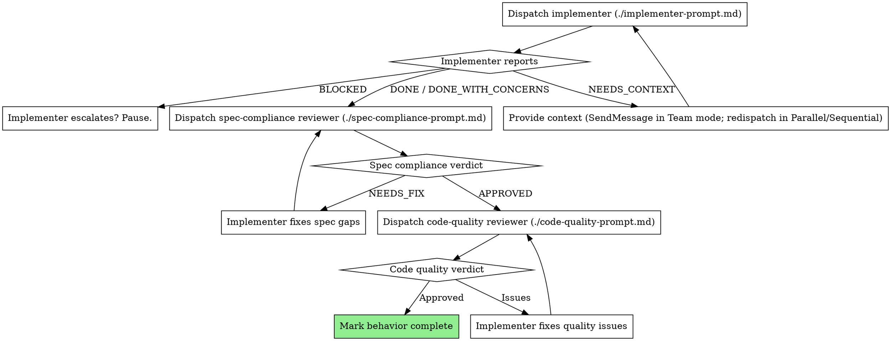

# Subflow (DTDD Build phase)

Third of three phases in a Doc-Test-Driven Development cycle. The orchestrator wrote the spec (`designflow`) and the failing tests (`testflow`); `subflow` runs the build phase by dispatching one subagent per behavior, with two-stage review after each. The orchestrator coordinates; subagents implement.

The name reads as "the subagent flow" — a subset of the wovenflow workflow that runs entirely through dispatched subagents.

## How tests run (read this first)

The test code in the `.spec.md` is **not directly runnable** — it lives inside markdown fences. The `testflow` skill's bundled extractor (`extract.mjs`) reads the `.spec.md` and writes derived test files (`.test.ts`, `.py`, `_test.rs`, etc., per the `--lang` flag) into the project's spec-test output directory. Those derived files are what the test runner actually executes.

### Standard path: pre-test hook

The exact mechanism depends on the project's stack. The shape is the same in every case: the extractor runs **before** the test command, so derived test files are fresh.

**TypeScript / JavaScript** (npm `pretest` lifecycle hook):

```json
"scripts": {
  "pretest": "node <plugin-path>/skills/testflow/extract.mjs 'doc/specs/**/*.spec.md' out/spec-tests/",
  "test": "<your test runner> out/spec-tests/*.test.ts"
}
```

**Python** (pytest `conftest.py` or Makefile target — see `wovenflow:testflow` for full options):

```python
# conftest.py
import subprocess
def pytest_configure(config):
    subprocess.run([
        "node", "<plugin-path>/skills/testflow/extract.mjs",
        "doc/specs/**/*.spec.md", "out/spec-tests/", "--lang", "python",
    ], check=True)
```

**Other languages** (Rust / Go / Ruby): wire `extract.mjs --lang <lang>` into the project's pre-test step (cargo build script, go generate, Rake task, Makefile). See `wovenflow:testflow` for examples.

Whatever the wiring, **subagents do not invoke the extractor manually** — running the project's test command is enough. If extraction isn't wired, the orchestrator must wire it before dispatching subagents.

### Bundled run scripts (TypeScript / JavaScript only)

For situations where the project's `npm test` doesn't apply — running tests directly from the plugin, iterating on one behavior, debugging — `subflow` ships two convenience scripts alongside this `SKILL.md`:

| Script | Purpose | CLI |
|---|---|---|
| **`run-suite.mjs`** | Extract a `.spec.md` glob, run every behavior's test through `node:test`. | `node run-suite.mjs <glob-or-file> [<output-dir>]` |
| **`run-behavior.mjs`** | Extract one `.spec.md`, run only one behavior's test (filtered by id). | `node run-behavior.mjs <spec-file> <behavior-id>` |

These are TS/JS-specific (they wrap `node:test`). Python / Rust / Go / Ruby projects iterate via the language's native test runner directly — `pytest -k <pattern>`, `cargo test <name>`, etc.

## When to use

After `testflow`. Pre-conditions to verify before dispatching:

- The `.spec.md` is committed to a branch (subagents reference it by path)
- Pre-test extraction is wired into the project (npm `pretest` script for TS/JS, `conftest.py` or Makefile target for Python, equivalent for other languages)
- Running the project's test command once shows red — every behavior's test fails. That's the canonical TDD red moment; this skill turns it green.

If any pre-condition isn't met, fix that first; do not dispatch implementers against a partial setup.

**Bug fixes are DTDD-shaped too.** Don't bypass the pipeline for bug-fix bursts. The failing record / repro IS the failing test — extract it as a regression test in `testflow`, spec the corrected behavior in `designflow`, then dispatch via this skill. Hand-rolling parallel dispatch via Claude Code's `Agent` tool with `isolation: "worktree"` looks simpler but has different (and inconsistent) close-time semantics than this skill's `worktree.mjs` — see Red flags below.

## Why subagents

The orchestrator owns the contract; subagents own implementation. Subagents work in isolated context — they're given the spec file path and a behavior identifier, not pasted task text — and they read the canonical source themselves. This:

- Keeps the orchestrator's context clean for coordination
- Gives each implementer a fresh, scoped focus on one behavior
- Lets subagents see the *full* spec context (other behaviors, user stories, invariants) — pasted text would lose this
- Eliminates drift risk — if the spec evolves between dispatch and re-try, the subagent re-reads the current truth
- Makes commits and error references point to the canonical artifact (`B1` from `doc/specs/<feature>.spec.md`)

## The unit of work is a behavior

Each H3 behavior section (`### B1: ...`) in the spec is one task. One subagent implements one behavior. The behavior may touch many files — that's fine; the unit isn't files, it's the contract.

If two behaviors share enough implementation that splitting them produces redundant work, dispatch them together (one subagent, two behaviors). Document the coupling in the dispatch prompt. Default is one-per-subagent unless coupling is obvious.

## Dispatch modes

Subflow supports three dispatch modes. The orchestrator picks the best available at the start of the run.

| Mode | When | Recommended for |
|---|---|---|
| **Team mode** | `CLAUDE_CODE_EXPERIMENTAL_AGENT_TEAMS=1` is set and `TeamCreate` is available | Default when the flag is on. Persistent named teammates, mid-flight messaging, shared task list. |
| **Parallel mode** | Flag off; worktrees viable | Default when the flag is off. One-shot subagent dispatch per behavior into per-behavior worktrees. |
| **Sequential mode** | Flag off; worktrees not viable, or behaviors share scaffolding | Fallback. One subagent at a time in the orchestrator's working tree. |

**Mode detection:** at start of the run, the orchestrator probes `TeamCreate`. If it succeeds, Team mode. If it errors with "tool not available" (or equivalent indicating the flag isn't set), fall back to Parallel mode. Report the chosen mode in the first progress message so the user can see which path is running.

**Recommended:** set `CLAUDE_CODE_EXPERIMENTAL_AGENT_TEAMS=1` in your Claude Code settings (`~/.claude/settings.json` under `env`, or per-project `.claude/settings.json`). Subflow runs without it; the flag unlocks the better path. Configure via `update-config` or edit `settings.json` directly.

## Team mode (recommended; flag on)

Replaces the one-shot dispatch model with **persistent named teammates** who share a task list and exchange messages. Worktree mechanics stay identical to Parallel mode (one tree per behavior, same `worktree.mjs` helper); only the dispatch and coordination layer changes.

### Why Team mode

Three concrete wins over Parallel mode:

1. **`NEEDS_CONTEXT` becomes a message, not a re-spawn.** Implementer DMs the orchestrator with the question and idles; orchestrator answers; implementer resumes from the same context. No re-spawn cost (no re-reading spec, no re-loading codebase).
2. **Reviewers persist across behaviors.** One `spec-reviewer` and one `quality-reviewer` teammate stay alive for the whole subflow run, picking reviews off the shared task list. They build pattern memory ("B1 had a similar lifecycle issue") instead of cold-starting per behavior.
3. **Peer DMs surface coupling early.** Implementers can message peers about shared interfaces and naming. Orchestrator sees a summary in idle notifications and intervenes only when needed. Conflicts that would otherwise show up at merge time surface during implementation.

### Setup

1. **Probe + create the team.**
   ```
   TeamCreate({
     team_name: "wovenflow-<feature-slug>",
     description: "Subflow build for <spec-filename>"
   })
   ```
   Slug = `.spec.md` basename, lowercased, no path. One team per feature.

2. **Create a worktree per behavior** (same as Parallel mode):
   ```
   node <plugin>/skills/subflow/worktree.mjs create B1
   ```

3. **Spawn implementer teammates** — one per behavior, in a single message:
   ```
   Agent({
     subagent_type: "general-purpose",
     team_name: "wovenflow-<feature-slug>",
     name: "impl-B1",
     prompt: <implementer-prompt.md filled in for B1>,
     working_dir: <worktree path for B1>
   })
   ```
   Use `name: "impl-Bn"` so peers and reviewers can address each other by behavior id.

4. **Spawn two persistent reviewer teammates** — `spec-reviewer` and `quality-reviewer`. They stay alive across all behaviors and pick reviews off the shared task list.

5. **Seed the task list.** `TaskCreate` one task per behavior:
   - `id: "impl-Bn"`, `owner: "impl-Bn"`, `status: "in_progress"`, `description: "Implement Bn per <spec>"`.
   - Reviewer tasks (`review-Bn-spec`, `review-Bn-quality`) are created later, when each implementer marks its task done.

### Lifecycle (per behavior)

1. Implementer reads its task; reads `.spec.md` by file path; implements; runs tests green; commits in its worktree; marks its task `completed` via `TaskUpdate` with verdict (`DONE` / `DONE_WITH_CONCERNS`) in notes; idles.
2. Orchestrator receives the idle notification with task summary. Creates `review-Bn-spec` task assigned to `spec-reviewer`.
3. `spec-reviewer` wakes on assignment, reviews in the Bn worktree, marks task `completed` with verdict (`APPROVED` / `NEEDS_FIX` / `BLOCKED`) in notes, idles.
4. If `NEEDS_FIX`: orchestrator `SendMessage`s `impl-Bn` with the fix list. Implementer wakes, fixes, marks the original task done again. **No re-spawn** — same context, same persona, same in-memory state.
5. If `APPROVED`: orchestrator creates `review-Bn-quality` task assigned to `quality-reviewer`. Same loop for code-quality verdict (Critical / Important / Minor).
6. When both reviews approved: orchestrator runs `worktree.mjs merge Bn <orchestrator-branch>`. Worktree torn down.
7. After all behaviors merged: orchestrator sends `shutdown_request` to each teammate, awaits approvals, calls `TeamDelete`.

### Mid-flight clarification (the NEEDS_CONTEXT path)

When an implementer hits ambiguity:

- It does **not** terminate. It sends:
  ```
  SendMessage({ to: "team-lead", summary: "B1 needs context", message: "..." })
  ```
- Orchestrator answers via `SendMessage` to `impl-B1`.
- Implementer resumes from the same state. No spec re-parse, no codebase re-orient.

### Peer DMs (cross-behavior coordination)

Implementers can DM peers about shared interfaces, naming choices, or invariants:

> `impl-B1` → `impl-B3`: "I'm exposing this as `User.signup(email, password)`. Does that match what you're consuming?"

Orchestrator sees a brief summary in its idle notification (peer DM visibility). Don't intervene unless coordination escalates.

**Source-of-truth rule (critical):** peer DMs are **clarification only**. They surface ambiguity; they do **not** resolve it through informal agreement. If a peer DM reveals that the spec is under-specified (two behaviors must agree on a shape the spec doesn't pin down), the implementers **must escalate to the orchestrator**. The orchestrator updates the `.spec.md`, re-notifies impacted teammates via `SendMessage`, and re-runs the pretest extractor if test code changed. Peers do **not** "just decide together" and proceed — that's spec drift, and the spec-compliance reviewer will catch it as `NEEDS_FIX` (implementation doesn't match the prose).

### TaskUpdate as the status surface

In Team mode, status reporting flows through the shared task list, not subagent return values:

| Event | TaskUpdate |
|---|---|
| Implementer ready to review | `status: completed`, `notes: "DONE: <one-paragraph summary>; tests <N> pass"` |
| Implementer ran into uncertainty | `notes: "NEEDS_CONTEXT: <question>"` plus `SendMessage` to team-lead |
| Implementer blocked structurally | `status: blocked`, `notes: "BLOCKED: <reason>"` plus `SendMessage` to team-lead |
| Spec-reviewer verdict | `status: completed`, `notes: "APPROVED" | "NEEDS_FIX: <list>" | "BLOCKED: <reason>"` |
| Quality-reviewer verdict | `status: completed`, `notes: "APPROVED" | "Issues: Critical=...; Important=...; Minor=..."` |

The status semantics (DONE / DONE_WITH_CONCERNS / NEEDS_CONTEXT / BLOCKED for implementers; APPROVED / NEEDS_FIX / BLOCKED for spec reviewer; APPROVED / Issues for quality reviewer) are unchanged from Parallel mode — only the wire mechanism differs.

### Cleanup

- **Normal completion:** orchestrator sends `shutdown_request` to each teammate, waits for `shutdown_response: approve=true`, then calls `TeamDelete`.
- **Abort:** same shutdown sequence first. If teammates don't respond, force-terminate via the Agent tool's normal cleanup, then `TeamDelete` (which fails while members are active; the force-cleanup must happen first).
- **Orphaned teams** (e.g., subflow killed mid-run): the next subflow run on the same feature should detect a stale `wovenflow-<slug>` team via `~/.claude/teams/`. Force-cleanup any leftover members and `TeamDelete` before `TeamCreate`-ing fresh.

## Parallel mode (fallback when flag is off)

When `CLAUDE_CODE_EXPERIMENTAL_AGENT_TEAMS=1` is **not** set, behavior-implementer subagents run in parallel as one-shot dispatches. Each gets its own git worktree, branched from the same starting commit. They never compete for files, never see each other's half-built code, and commit to independent branches that the orchestrator merges back when reviews approve.

### The mechanism

1. **Orchestrator creates one worktree per behavior** before dispatch, using the bundled helper:
   ```
   node <plugin>/skills/subflow/worktree.mjs create B1
   # prints: /path/to/repo/.wovenflow/worktrees/B1
   ```
   Each worktree is on a branch named `wovenflow/<behavior-id>` (lowercased), branched from the orchestrator's HEAD.

2. **Orchestrator dispatches all implementers in one message** — multiple Task tool calls in a single response. Each subagent receives its worktree path as its working directory. They run concurrently in isolation.

3. **Each subagent**: reads the spec (frozen at the shared starting commit), implements the behavior, runs tests until green, commits on its worktree's branch, reports status.

4. **Reviewers run in the same worktree.** Spec-compliance and code-quality reviewers get the same working_dir; they review only that subagent's branch.

5. **Merge-back is sequential and orchestrator-driven.** After each behavior's reviews approve:
   ```
   node <plugin>/skills/subflow/worktree.mjs merge B1 <orchestrator-branch>
   ```
   This merges `wovenflow/b1` into the orchestrator's branch with `--no-ff`, removes the worktree, and deletes the branch.

6. **On merge conflict**: behaviors were coupled. The orchestrator pauses, inspects the conflict, and either resolves manually (if trivial) or re-dispatches the conflicting behavior in a fresh worktree branched from the post-merge state.

### Why this works

- **No file collisions.** Each subagent edits files in its own working tree.
- **No spec drift.** All worktrees branch from the same commit, so every subagent reads the same `.spec.md`.
- **Independent test runs.** Each worktree has its own spec-test output directory (the pre-test extractor writes there). Parallel test runs don't share output.
- **Conflicts surface late and explicitly.** If two behaviors did touch the same code, the merge step is where it shows up — caught by git, not by quietly stomping.

### Shared dependency dirs (avoid re-installing per worktree)

Fresh git worktrees start with an empty working tree — no `node_modules`, no `.venv`, no `vendor/bundle`. Re-installing per worktree is the dominant overhead for ecosystems without a content-addressed store (npm-classic, pip+venv, classic Cargo, classic Bundler).

`worktree.mjs create` mitigates this by symlinking shared dependency directories from the repo root into each new worktree. By default it links `node_modules`. Override with the `WOVENFLOW_WORKTREE_LINKS` env var (colon-separated paths):

```
# Python project using a shared venv
WOVENFLOW_WORKTREE_LINKS=".venv" node <plugin>/skills/subflow/worktree.mjs create B1

# Node + extra cache
WOVENFLOW_WORKTREE_LINKS="node_modules:.cache" node <plugin>/skills/subflow/worktree.mjs create B1

# Disable entirely
WOVENFLOW_WORKTREE_LINKS="" node <plugin>/skills/subflow/worktree.mjs create B1
```

Each path is symlinked only if it exists in the repo root. The symlinks are unlinked before `merge` and `cleanup`, so git's worktree removal never traverses into the shared target.

**Caveat:** if a behavior installs a new dependency, it goes into the shared directory and other parallel subagents see it mid-flight. In practice this is rare (most behaviors don't add deps) and harmless (the new package is invisible until imported). If a project's behaviors *do* install deps in parallel, disable the symlink and accept per-worktree install cost — or use a content-addressed package manager (pnpm, uv, yarn-berry) where install-per-worktree is fast.

### Cleanup on failure

If an implementer reports BLOCKED or a behavior is abandoned:
```
node <plugin>/skills/subflow/worktree.mjs cleanup B<N>
```
This force-removes the worktree and deletes its branch. The orchestrator's main worktree is unaffected.

### When to fall back to sequential

Switch to sequential single-tree dispatch only when:

- Most behaviors clearly modify the same surface (e.g., all behaviors edit one file, or rely on a shared scaffold that one behavior must build first).
- Worktrees aren't viable (rare — bare repos, certain CI environments).
- Debugging one behavior in isolation, where parallel output would be noise.

In sequential mode, dispatch one subagent at a time in the orchestrator's main working directory and skip the worktree helper.

## Subagent input pattern (canonical)

Every subagent — implementer, spec-compliance reviewer, code-quality reviewer — gets these three inputs:

| Input | Example |
|---|---|
| **Spec file (absolute path)** | `/path/to/project/doc/specs/2026-05-04-feature.spec.md` |
| **Behavior identifier** | `B1` (matches the H3 header in the spec) |
| **Working directory** | `/path/to/project/.wovenflow/worktrees/B1` (per-behavior worktree in Team and Parallel modes; the project root in Sequential mode) |

In **Team mode**, also:

| Input | Example |
|---|---|
| **Team name** | `wovenflow-2026-05-04-feature` |
| **Teammate name** | `impl-B1`, `spec-reviewer`, `quality-reviewer` |
| **Task id** | `impl-B1`, `review-B1-spec`, `review-B1-quality` (the task this teammate is working) |

Subagents do NOT receive paste-text of the behavior. They open the file and read it. This is the central design choice that makes the system honest:

- The `.spec.md` is the source of truth. Subagents read truth.
- If the spec is updated mid-cycle, the subagent reads the current version on retry (or after a `SendMessage` notification in Team mode).
- Commits, error logs, and review comments reference the file path — git history points back to the contract.
- In Team mode, peer DMs are clarification only; the spec is the only durable contract.

## The process (per behavior)

The diagram below shows the **logical lifecycle** of one behavior's subagent and its reviewers. The lifecycle is the same in all modes; only the wire mechanism differs:

| Step | Team mode | Parallel mode | Sequential mode |
|---|---|---|---|
| "Dispatch implementer" | spawn as named teammate; assign task | one-shot Agent call to per-behavior worktree | one-shot Agent call to main worktree |
| "Provide context" on `NEEDS_CONTEXT` | `SendMessage` to idle implementer | re-dispatch fresh subagent | re-dispatch fresh subagent |
| "Dispatch reviewer" | assign new task to persistent `spec-reviewer` / `quality-reviewer` | one-shot Agent call | one-shot Agent call |
| "Implementer fixes" | `SendMessage` with fix list to idle implementer | re-dispatch with fix list | re-dispatch with fix list |
| "Mark behavior complete" | `TaskUpdate` to completed; orchestrator runs merge | orchestrator runs merge | orchestrator continues |



Spec compliance review runs before code quality review. Order matters: there's no point reviewing the cleanliness of code that doesn't satisfy the contract.

## Implementer status reporting

Implementers report exactly one of four statuses. The semantics are the same in all modes; the wire mechanism differs.

| Status | Team mode | Parallel / Sequential |
|---|---|---|
| **DONE** | `TaskUpdate` to completed; notes start with `DONE:` | Subagent returns with `DONE` status |
| **DONE_WITH_CONCERNS** | `TaskUpdate` to completed; notes start with `DONE_WITH_CONCERNS:` and list the concerns | Subagent returns with that status and concerns |
| **NEEDS_CONTEXT** | `SendMessage` to team-lead with the question; teammate idles | Subagent terminates with `NEEDS_CONTEXT` and the question |
| **BLOCKED** | `TaskUpdate` to blocked; `SendMessage` to team-lead with the issue | Subagent terminates with `BLOCKED` and the reason |

Handle each:

- **DONE.** Tests green, contract met, no concerns. Proceed to spec-compliance review (next teammate task in Team mode; new dispatch in Parallel / Sequential).
- **DONE_WITH_CONCERNS.** Tests green, but the implementer flags something (file getting large, pattern smells, a related behavior they noticed). Read the concerns; fold relevant ones into the next review pass. If concerns suggest a real bug or scope mismatch, address before reviewing.
- **NEEDS_CONTEXT.** Implementer can't proceed without information that wasn't in the spec or codebase. **Team mode:** answer via `SendMessage`; the implementer resumes from the same context. **Parallel / Sequential:** provide the missing context and re-dispatch the same subagent (don't start over).
- **BLOCKED.** Fundamental issue — spec is wrong, conflicts with other behaviors, requires architectural change beyond this behavior's scope. **Pause the cycle**, read the report, decide: fix the spec (orchestrator returns to `testflow` or `designflow`), or escalate to user.

Never ignore an escalation. If the implementer says they're stuck, something needs to change.

## Reviewer cycle (one or both stages may need to run twice)

Spec compliance reviewer returns one of:
- **APPROVED.** Test passes, contract met, no scope creep, no regressions. Proceed.
- **NEEDS_FIX.** Specific list of issues. Send to implementer to fix; re-dispatch reviewer to re-check.
- **BLOCKED.** Reviewer believes the spec itself is wrong (e.g., test contradicts the If/When/Then prose). Pause, escalate to orchestrator.

Code quality reviewer returns:
- **APPROVED.** Behavior is complete.
- **Issues** (Critical / Important / Minor). Critical and Important must be fixed before completion. Minor can be deferred to a follow-up issue.

Re-review after each fix until both stages approve.

## Model selection

Match model to task complexity:

- **Mechanical implementation** (one behavior, isolated file, clear contract) — fast/cheap model
- **Integration** (multiple files, cross-behavior coordination) — standard model
- **Architecture / debugging escalation** — most capable model

Reviewers can usually run on the same tier as the implementer or one tier lower.

## Prompt templates

- `./implementer-prompt.md` — dispatch the implementer
- `./spec-compliance-prompt.md` — dispatch the spec reviewer
- `./code-quality-prompt.md` — dispatch the code-quality reviewer

Each template specifies how to fill in the spec file path, behavior identifier, and working directory. Templates do not include paste-text of the behavior — file pointer only.

## Red flags

These mean STOP and reconsider:

| Sign | What to do |
|---|---|
| Tempted to paste behavior text into the prompt | Don't. Use the file pointer. The spec is canonical. |
| Implementer modifies the .spec.md to make tests pass | Reject. Spec is the contract. Re-dispatch with a clear "do not modify the spec" instruction. |
| Reviewer says "tests pass but the contract isn't actually met" | The spec is wrong (under-specified test). Pause, escalate to orchestrator to revise the spec. |
| Implementer adds code unrelated to the behavior | Spec compliance reviewer catches this. NEEDS_FIX with "remove out-of-scope additions." |
| Two behaviors clearly share implementation but were dispatched separately | OK to combine future dispatches; complete the current ones independently. |
| Subagent finishes "suspiciously fast" | Trust verification, not reports. Reviewer's job is to verify by reading code and running tests. |
| Tempted to dispatch via Claude Code's `Agent` tool with `isolation: "worktree"` | Don't. That's the harness's worktree machinery — separate code path from this skill's `worktree.mjs`, with inconsistent close-time semantics (commits sometimes auto-merge onto master, branches sometimes deleted, sibling close-time races can wipe in-flight merges). `worktree.mjs create <id>` produces a named branch (`wovenflow/<id>`) at a predictable path with a deterministic merge protocol. Use it always. |
| Two implementers DM each other to "decide" on an interface or naming, then proceed without spec update | That's spec drift. Peer DMs are clarification only. Either escalate to the orchestrator (who updates the `.spec.md` and re-notifies impacted teammates) or stop and surface the under-specification as a `BLOCKED` status. The reviewer will catch silent peer agreements as `NEEDS_FIX` because the implementation won't match the prose. |
| Team mode: orchestrator polls teammate state via Bash or `TaskList` instead of waiting for messages | Idle notifications are automatic. Polling burns context and rate limits. Wait for the system to deliver. |
| Stale `~/.claude/teams/wovenflow-<slug>/` directory left from a prior run | Force-cleanup leftover members and `TeamDelete` before `TeamCreate`-ing fresh. Don't try to reuse an orphaned team. |

## Integration with other wovenflow skills

- `wovenflow:designflow` — wrote the prose contract (Design phase)
- `wovenflow:testflow` — wrote the failing tests (Test phase)
- **`wovenflow:subflow`** (this skill) — make the failing tests pass (Build phase)

After Phase 6 completes, exit DTDD; the workstream proceeds to verification (`/verify`) and then ship (`/ship-pr` for PR-based projects or `/ship-direct` for solo / no-PR projects).

## Integration with superpowers

- `superpowers:test-driven-development` — its Iron Law ("no production code without a failing test first") is structurally satisfied by Phase 5 (the orchestrator wrote the failing test). Subagents are AT the red moment when dispatched; their job is green.
- `superpowers:requesting-code-review` — the code-quality reviewer template uses this framework.
- `superpowers:dispatching-parallel-agents` — wovenflow's parallel dispatch is built-in (see "Parallel dispatch (default)" above). Consult the superpowers skill for orchestrator dispatch patterns not specific to DTDD.

## Why not just use superpowers:subagent-driven-development?

That skill assumes plan files with paste-text task curation and prescribed file structure. DTDD's `.spec.md` is canonical, behaviors are read in place, and file structure is the implementer's judgment. Templates differ enough to fork — see this skill's prompt templates for the DTDD-native shape.
